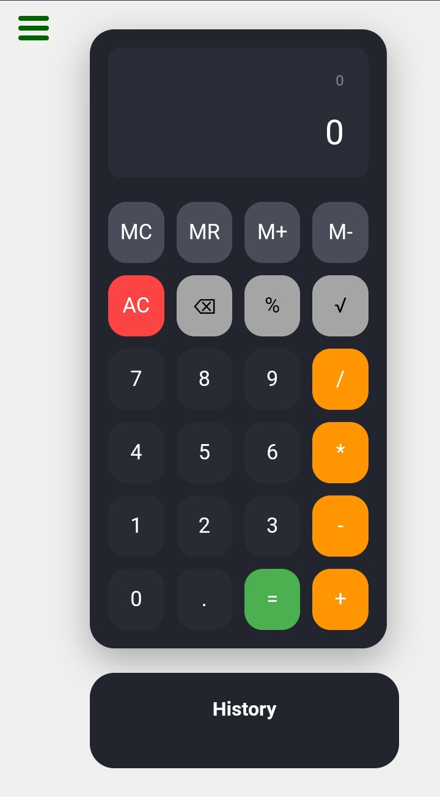

# React Calculator

## Overview

This React Calculator is an advanced implementation of the JavaScript Calculator project, which is part of the freeCodeCamp Front End Development Libraries Certification. It goes beyond the basic requirements to provide a feature-rich, responsive, and user-friendly calculator application.

## Features

- Basic arithmetic operations (addition, subtraction, multiplication, division)
- Decimal point calculations
- Clear and backspace functionality
- Percentage calculations
- Square root function
- Memory operations (M+, M-, MR, MC)
- Calculation history
- Responsive design for various screen sizes

## Technologies Used

- React
- HTML5
- CSS3
- JavaScript (ES6+)

## Project Requirements

This calculator fulfills all user stories required by the freeCodeCamp project:

1. Clickable elements for numbers 0-9, operators, decimal point, equals, and clear
2. A display element to show input and results
3. Clear button functionality
4. Chained operations
5. Proper handling of decimals and leading zeros
6. Formula logic for calculations
7. Precision to at least 4 decimal places

## Additional Functionalities

Beyond the basic requirements, this calculator includes:

- Memory functions for complex calculations
- Square root and percentage operations
- Backspace feature for input correction
- Calculation history for reference

## Responsive Design

The calculator is designed to be fully responsive, providing an optimal user experience on both desktop and mobile devices.

## How to Run

1. Clone this repository
2. Navigate to the project directory
3. Run `npm install` to install dependencies
4. Run `npm start` to start the development server
5. Open `http://localhost:3000` in your browser

## Credits

This project was completed as part of the [freeCodeCamp](https://www.freecodecamp.org/) Front End Development Libraries Certification.

## License

This project is open source and available under the [MIT License](LICENSE).
